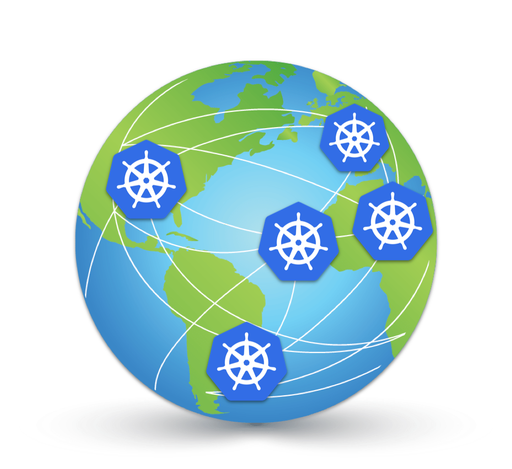

# kubeCDN
A self-hosted content delivery network based on Kubernetes. 

## Instructions
*(rough draft of instructions)

1. Build infrastructure: this will build EKS masters, worker nodes etc.
	* `cd` to `terraform` and run `terraform apply`
	* Install dashboard: `./setup.sh` (**needs to be updated**)
2. Install helm into cluster (**may not be needed**)
3. Install ExternalDNS - from `externalDNS` dir
	* **ExternalDNS does not work as intended** 
4. Deploy service
